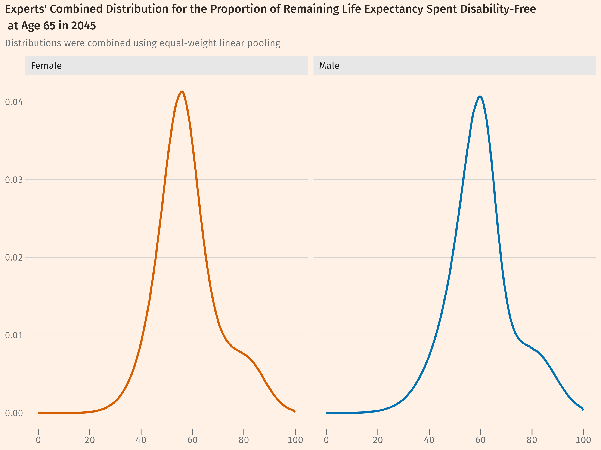
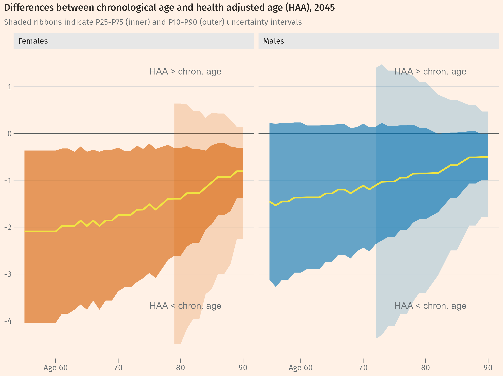

## Background
Demographic change affects the need for healthcare through two main channels.

* First, healthcare need rises with population size: a larger population requires more care than a smaller one.
* Second, need rises as the population ages, because older people tend to use more healthcare per person than younger people.

The basic idea that larger and older populations require more healthcare is straightforward. However, this often overlooks differences in health status. Research shows that healthcare use depends ultimately on people’s health status and functional ability, not simply on their age. Although age is a useful proxy for health status&mdash;reflected in the steep increase in healthcare spending at older ages&mdash;it is not itself the causal factor.

Approaches that ignore health status implicitly assume that age-specific healthcare use remains constant over time. This overlooks the possibility that rising life expectancy may make older people "younger", healthier, and fitter than equivalent age groups in earlier generations, and therefore risks overstating the effect of population ageing on healthcare demand.

## Evidence on trends in population health
Good data on population health by age is limited, and existing evidence on long-term trends in health status&mdash;including the prevalence of chronic illness, disability, and self-reported health&mdash;presents a mixed picture.

As life expectancy continues to rise, there is ongoing debate about whether the additional years of life gained by recent and future cohorts will be spent in good health or in disability and frailty.

Given the uncertainty surrounding future trends in population health, structured expert elicitation was used to inform assumptions about how disability-free life expectancy may evolve over time.

## Calibrating an adjustment for health status
An expert elicitation exercise on future population health took place in November 2025. Its purpose was to help the [Strategy Unit](https://www.strategyunitwm.nhs.uk/) (SU) and the New Hospital Programme (NHP) form a view about how population health status may evolve over the coming decades.

The central question considered was:

> For an average 65-year-old man or woman in 2045, from the middle deprivation quintile, what proportion of their remaining life expectancy will be spent free of disability (that is, without a limiting long-standing illness)?

Across two rounds, each expert provided three estimates: a "most likely" value (the mode), a "surprisingly low" outcome (10th percentile, P10), and a "surprisingly high" outcome (90th percentile, P90), together with rationales for each.

@fig-expert-dist shows the pooled expert distributions for the proportion of remaining life expectancy at age 65 expected to be spent free of disability in 2045. The height of the curve at any point reflects the collective weight the panel placed on values in that region. Relative to the 2021 baseline values (50.9% for females and 56.9% for males), the experts’ most likely estimates&mdash;56.1% for females and 59.9% for males&mdash;imply that a greater share of later life will be spent disability-free in future cohorts.

The distributions are positively skewed, indicating that experts generally viewed larger improvements in disability-free life expectancy as more plausible than substantial deterioration. For females, the pooled distribution has a P10 of 44.0% and a P90 of 76.3%; for males, the corresponding values are 45.0% and 78.5%.

The slight shoulder visible in the upper part of the distributions reflects the influence of a comparatively optimistic expert judgement. Because responses were combined using equal-weight pooling, the pooled distributions retain the diversity of views expressed during the elicitation exercise.

The remainder of this document describes how the elicited distribution is used to calibrate a health-status adjustment within the demographic-change component of the wider NHP model for estimating future healthcare demand.

{width=100% fig-align="center" #fig-expert-dist}

## Using the expert probability distribution
The expert elicitation exercise produced a pooled probability distribution for the proportion of remaining life expectancy at age 65 expected to be spent free of disability in 2045. Two additional steps were required before the distribution could be incorporated into the NHP modelling framework.

1. The elicited distribution was approximated using a [metalog distribution](https://en.wikipedia.org/wiki/Metalog_distribution). This provided a flexible parametric representation that could be sampled efficiently within the model engine while preserving the main characteristics of the expert distribution. Full details of the fitting approach and validation process are provided in a separate [technical note](../docs/metalog_approximation.ipynb).

2. The distribution was extended across the full modelling horizon. Although the elicitation exercise focused on 2045, it was important to retain flexibility over the projection horizon used in the model. The 2045 distribution was therefore extrapolated backwards to generate year-specific distributions describing the proportion of gains in life expectancy expected to be spent free of disability over time. This approach allows the model to support alternative projection horizons. Full details of the extrapolation approach are provided in a separate [technical note](https://github.com/The-Strategy-Unit/health-status-ee-exercise).

## Health-adjusted age
In our approach to modelling the impact of population ageing on future healthcare demand, individuals are assigned a *health-adjusted age* in addition to their chronological age. It is this health-adjusted age, rather than chronological age alone, that determines their level of healthcare use.

Health-adjusted age is constructed by adjusting chronological age to reflect expected improvements in population health over time. Specifically, we subtract from chronological age a proportion of projected gains in life expectancy over the model horizon, based on life table projections.

The adjustment factor is derived by combining the results of the expert elicitation exercise with data on current disability-free life expectancy (DFLE), period life expectancy, and projections of future life expectancy. This produces a distribution describing the proportion of gains in life expectancy expected to be spent free of disability, which is then used to construct an estimate of health-adjusted age.

Formally:

::: {style="margin-bottom: 40px; line-height: 1.8;"}
$\text{QOI}_{y,f|m}$ elicited estimate, for year *y*, of the proportion of remaining life expectancy at age 65 spent disability-free, by sex.  
$\text{ex}_{65,y,f|m}$ remaining life expectancy at age 65 in year *y*, by sex. 
$\text{ex}_{i,y,f|m}$ remaining life expectancy at age *i* in year *y*, by sex. 
$\text{DFLE}_{2021,f|m}$ disability-free life expectancy at age 65 in 2021, by sex. 
:::

$$
\begin{align}
\text{Health adjustment factor}_{y,f|m} = \dfrac{\text{QOI}_{y,f|m} \times ex_{65,y,f|m} - \text{DFLE}_{2021,f|m}}{ex_{65,y,f|m} - ex_{65,2021,f|m}} \tag{1}
\end{align}
$$

::: {style="margin-bottom: 40px; line-height: 1.8;"}
For someone of chronological age *i*, health-adjusted age is then given by:
:::

$$
\begin{align*}
\text{health-adjusted age}_{y,f|m} =\ & \text{chron. age} \\
& - \left\{\text{health adjustment factor}_{y,f|m} \times (ex_{i,y,f|m} - ex_{i,2021,f|m})\right\} \tag{2}
\end{align*}
$$

## Estimates of health-adjusted age
@fig-haa-diffs shows, for 2045, the difference between health-adjusted age (HAA) and chronological age across the 55–90 age range, separately for females and males. A negative value means that an individual’s HAA is lower than their chronological age&mdash;that is, they are in better health than a person of the same age in the 2025 baseline&mdash;and therefore expected healthcare use is lower. A value of zero would indicate no change in age-specific health status relative to baseline.

The median adjustment (yellow line; the midpoint of the distribution across simulation draws) is negative across all ages and both sexes, consistent with the assumption that future cohorts will spend a greater share of later life free of disability. The adjustment is somewhat larger in magnitude for females than males, and uncertainty (shaded ribbons show the P25&ndash;P75 and P10&ndash;P90 intervals) narrows at older ages, reflecting the fact that projected gains in remaining life expectancy become smaller with age. Since the health adjustment is proportional to these gains, variation between simulation draws correspondingly decreases at older ages.

{width=100% fig-align="center" #fig-haa-diffs}

## Health-adjusted age within the modelling framework
The demographic-change component of the NHP model estimates how future healthcare demand changes in response to population growth, population ageing, and changes in population health status.

This component adjusts future healthcare demand by combining demographic change (population size and age structure) with changes in population health status, which are incorporated through health-adjusted age.

The process operates in five stages:

1. **Estimate health-adjusted age (HAA)**  
Health-adjusted age is calculated using the approach described in the previous section.

2. **Estimate baseline age–utilisation relationships**  
Baseline healthcare utilisation rates are modelled separately by sex and point of delivery using observed activity data. Smooth utilisation curves are fitted across age, providing an estimated baseline utilisation rate for each age–sex combination.

3. **Calculate the health-status adjustment multiplier**  
For individuals aged 55 years and over, the fitted utilisation rate corresponding to chronological age is compared with the fitted rate corresponding to health-adjusted age. The ratio between the two rates forms a health-status adjustment multiplier. Where health-adjusted age is lower than chronological age, this produces a downward adjustment to expected utilisation.

4. **Calculate the demographic multiplier**  
Projected population counts by age and sex are compared with baseline population counts to generate a demographic multiplier reflecting changes in population size and age structure over time.

5. **Combine adjustments within the model**  
For ages 55 years and over, the health-status adjustment multiplier and demographic multiplier are combined to produce an overall demographic-change multiplier by age and sex. For ages under 55 years, only the demographic multiplier is used. These multipliers are then applied to each cell within the record-level NHP model.

Finally, the model is run using Monte Carlo simulation to propagate uncertainty in future population health status. Draws are taken from the health-adjusted age distributions, and these are used to generate corresponding distributions of utilisation adjustments. Population projections by age and sex are treated as deterministic inputs within each scenario. Uncertainty in future healthcare demand therefore arises from variation in health status rather than from population structure.
